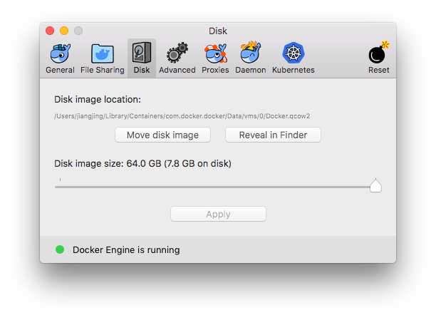

#	Make Friends With Docker In Mac OS X

All you need may be found in [docker.com][0].

##	Table of Contents

* [Before Installation](#before-installation)
* [Install](#install)
* [Install More](#install-more)
* [Get Started](#get-started)
	* [What are __image__ and __container__?](#what-are-image-and-container)
	* [How to push an image to hub.docker.com?](#how-to-push-an-image-to-hubdockercom)
	* [What is __docker machine__?](#what-is-docker-machine)
	* [What are __services__, __swarm__ and __stack__?](#what-are-services-swarm-and-stack)
	* [Play With Third-Party Registry](#play-with-third-party-registry)
* [Something You May Be Interested With](#something-you-may-be-interested-with)
* [TL;DR](#tldr)
	* [Quick Start](#quick-start)
	* [Login & Logout](#login--logout)
	* [Manage Images](#manage-images)
	* [Manage Containers](#manage-containers)

##	Before Installation

What's Docker? [*Docker products simplify, manage and secure containerized applications*][1.a]. They are:
*	Docker Enterprise
*	Docker Desktop
*	Docker Engine

[*Get Started with Docker*][1.b] will help you understand what to do with Docker according to what you are.

[*Overview of Docker editions*][1.c] will help you understand __CE__, __EE__ and the difference.

__ATTENTION:__ In Mac OS X, Docker Engine does not run natively. It actually runs in a virtual machine.

__Now, you knew it!__

##	Install

[Sign up][2.a] to [Docker Hub][2.b], then download  [__Docker Desktop (Mac)__][2.c]. Attention, it is a community edition (CE). If interested in enterprise edition, please read [*Introducing Docker Desktop Enterprise*][2.d]. 

You will get a [dmg][R.001] file. When download completed, open and install by "drag & drop" to os Applications folder.

__Now, you got it!__

__EXTENDED:__ Installing via homebrew is another choice,
```bash
# Install Docker Community Edition (CE).
brew cask install docker
```

__EXTENDED:__ Read following documents for more details:
*	[*Install Docker Desktop for Mac*][2.e]
*	[*Docker Desktop for Mac vs. Docker Toolbox*][2.f]

##	Install More

Softwares introduced in this section are not necessary.

[__Kitematic__][3.a] is *now part of Docker Toolbox*. It is not neccessary but helpful if you feel easy with [GUI][R.002].

[__Kubernetes__ (k8s)][3.b] is more difficult to be understood by newbies. 
> [Kubernetes vs. Docker: What Does It Really Mean?][3.c]  
> Docker is a platform and tool for building, distributing, and running Docker containers. It offers its own native clustering tool that can be used to orchestrate and schedule containers on machine clusters. Kubernetes is a container orchestration system for Docker containers that is more extensive than Docker Swarm and is meant to coordinate clusters of nodes at scale in production in an efficient manner.

##	Get Started

[*Get started*][4.a] will help you not only practice with Docker, but also understand it. After reading, you should get answers to the following questions.

###	What are __image__ and __container__?

Building with a file named `Dockerfile` will generate a new image. Running means to create a new container and execute commands which defined in an image.

```bash
docker build 
```

###	How to push an image to hub.docker.com?

```bash
# Login with your Docker Hub account.
docker login

# Create new tag for existing image.
docker tag <image> <username>/<reponame>:<tagname>

# Push to hub.docker.com.
docker push <username>/<reponame>:<tagname>
```

###	What is __docker machine__?

###	What are __services__, __swarm__ and __stack__?

To be continued.

###	Play With Third-Party Registry

```bash
# Pull image from third-party registry.
git pull <hostname>/<username>/<reponame>:<tagname>
```

__ATTENTION:__ Add the hostname to "insecure registries" if the registry does not accept SSL connection (https not supported).

##	Something You May Be Interested With

*	__Where images stored?__  
	You may get the answer via the *Disk* panel in the *Preferences* dialog of *Docker Desktop*. By default, it is  
	`~/Library/Containers/com.docker.docker/Data/com.docker.driver.amd64-linux/Docker.qcow2`  
	

##	TL;DR

###	Quick Start

```bash
# Show the Docker version information.
docker version

# Display system-wide information.
docker info

# List images.
docker images
docker image ls

# List all containers.
docker ps -a
docker container ls -a

# Show manual about sub command.
docker help <command>

# Run a command in a new container.
# Equal to `docker create` and `docker start`.
docker run <image>

# Start a container from an image and get a shell inside of it.
docker run -it <image> bash
docker run --interactive --tty <image> bash
```

### Login & Logout

```bash
docker login
docker logout
```

###	Manage Images

```bash
# -- create --

# Show available commands.
docker image -h

# Pull an image from a registry.
git pull [<hostname>/]<username>/<reponame>[:<tagname>]

# Create an image from Dockerfile.
# <path> should be a directory containing a file named "Dockerfile".
docker build <path>

# Create an alias for an image.
# <image> may be repository name or image id.
docker tag <image> <new_name>[:<tag>]

# -- info --

# Show the history of an image.
docker history <image>

# -- export & import --

# Save an image to a tar archive.
docker save <image> -o <path>

# Load an image from a tar archive.
docker import <path> [<nname>[:<tag>]]

# -- remove --

# Remove image.
docker rmi <IMAGE_ID>
docker image rm <IMAGE_ID>

# Remove all images.
docker rmi -f $(docker images -q)
```

###	Manage Containers

```bash
# Show available commmands.
docker container -h

# -- create --

# Create a container.
docker create <image>
docker create --name <container-name> <image>

# Rename a container.
# A random name will be generated by default when a container created.
docker rename <container> <new_name>

# Run a command in a new container.
# Equal to `docker create` and `docker start`.
docker run <image>

# Start a container from an image and get a shell inside of it.
docker run -it <image> bash
docker run --interactive --tty <image> bash

# -- start & stop --

# Start a container.
docker start <container>

# Stop a container.
docker stop <container>

# Stop all containers.
docker stop $(docker ps -aq)

# Kill a container.
docker kill <container>

# Restart a container.
docker restart <container>

# -- info --

# Display detailed information.
docker inspect <container>

# Inspect changes to files or directories on a container's filesystem.
# (current status) vs. (init status when created from an image)
docker diff <container>

# Display resource usage statistics of a container.
docker stats <container>

# Display the running processes of a container.
docker top <container>

# -- export & import --

# Copy files/folders between a container and the local filesystem.
docker cp <path> <container>:<path>
docker cp <container>:<path> <path>

# Export a container's filesystem as a tar archive.
docker export <container> -o <path>

# Create a new image.
docker commit <container> [<reponame>[:<tagname>]]

# -- interact --

# Attach local STDIO / STDERR to a running container.
docker attach <container>
# By default, press <^P,^Q> to detach.
# Use --detach-keys for customization.

# Fetch the logs of a container and stream to STDOUT.
docker logs <container>
# Fetch last 10 lines.
docker logs --tail 10 <container>
# Keep following.
docker logs -f <container>

# Run a command in a running container.
docker exec <container> <command>

# Pause/unpause all processes in a container.
docker pause <container>
docker unpause <container>

# Block until one or more containers stop, then print their exit codes.
docker wait <container>

# -- remove --

# Remove all containers.
docker rm $(docker ps -aq)
```

[0]: https://www.docker.com/
[1.a]: https://www.docker.com/products
[1.b]: https://www.docker.com/get-started
[1.c]: https://docs.docker.com/install/overview/
[2.a]: https://hub.docker.com/signup
[2.b]: https://hub.docker.com/
[2.c]: https://hub.docker.com/editions/community/docker-ce-desktop-mac
[2.d]: https://goto.docker.com/Docker-Desktop-Enterprise.html
[2.e]: https://docs.docker.com/docker-for-mac/install/
[2.f]: https://docs.docker.com/docker-for-mac/docker-toolbox/
[3.a]: https://kitematic.com/
[3.b]: https://kubernetes.io/
[3.c]: https://www.sumologic.com/blog/devops/kubernetes-vs-docker/
[4.a]: https://docs.docker.com/get-started/
[5.a]: https://blog.docker.com/2013/07/how-to-use-your-own-registry/
[R.001]: https://en.wikipedia.org/wiki/Apple_Disk_Image
[R.002]: https://en.wikipedia.org/wiki/Graphical_user_interface

[版权声明](../LICENSE/zh_cn.md) | [LICENSE](../LICENSE/en_us.md)